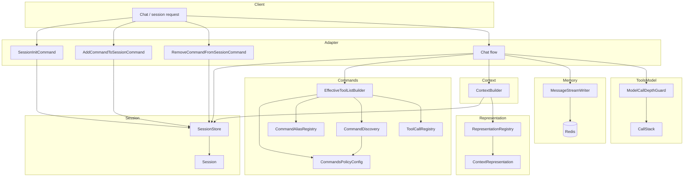
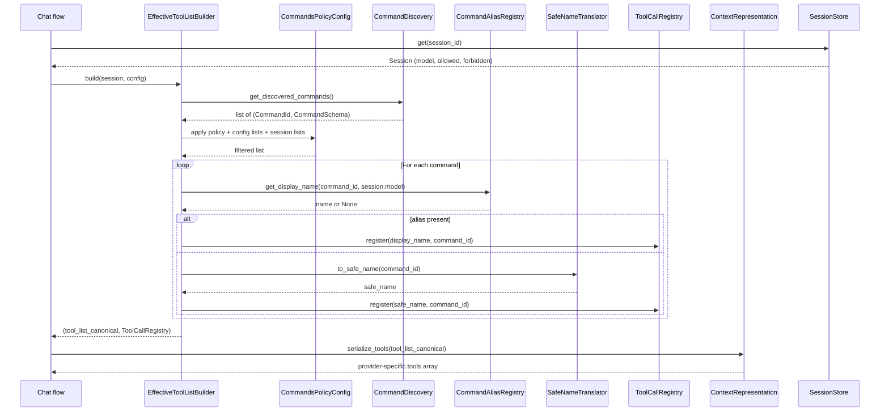
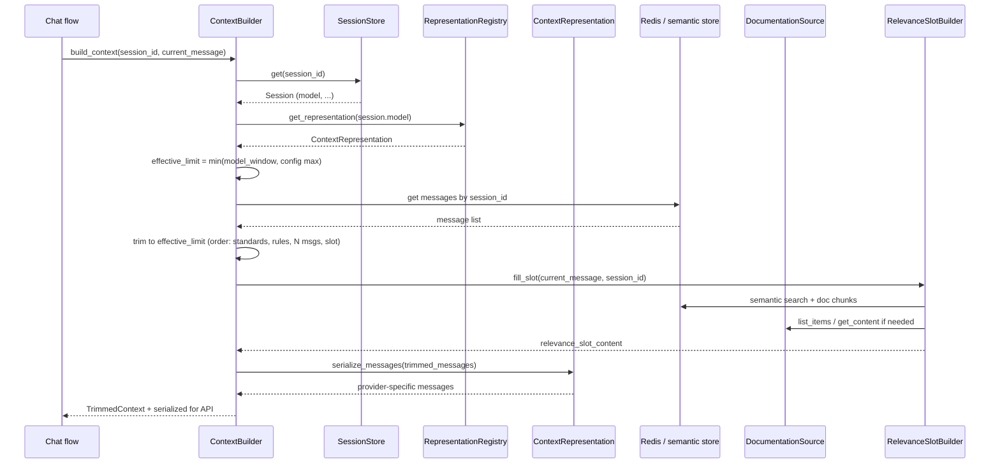
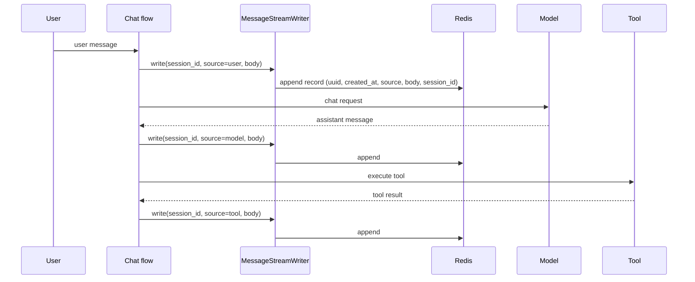
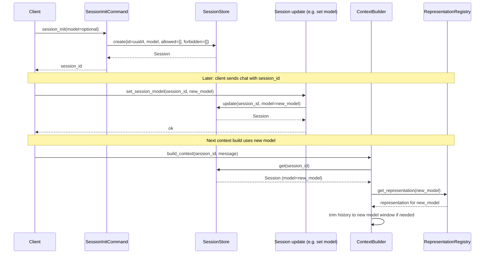

# Object scheme and interaction diagrams

**Author:** Vasiliy Zdanovskiy  
**Email:** vasilyvz@gmail.com  

This document defines the **object model** (by-object scheme) and **interaction diagrams** for the Dynamic commands and Redis memory plan. Main plan: [../DYNAMIC_COMMANDS_AND_MEMORY_PLAN.md](../DYNAMIC_COMMANDS_AND_MEMORY_PLAN.md).

---

## 1. Object list (summary)

See the **Object model (by-object scheme)** table in the main plan for the full list. Below: grouping by domain and diagram references.

- **Commands:** CommandsPolicyConfig, CommandId, SafeNameTranslator, ToolCallRegistry, CommandSchema, CommandDiscovery, CommandAliasRegistry, EffectiveToolListBuilder.
- **Session:** Session, SessionStore, SessionInitCommand, SessionUpdateCommand, AddCommandToSessionCommand, RemoveCommandFromSessionCommand.
- **Context representation:** ContextRepresentation (base), OllamaRepresentation, GoogleRepresentation (Gemini), RepresentationRegistry. Per-model context size and representation: see main plan [§2.5 Ollama and Google](../DYNAMIC_COMMANDS_AND_MEMORY_PLAN.md#25-per-model-scheme-context-size-and-representation-ollama-and-google).
- **Memory:** MessageSource, RedisMessageRecord (uuid, created_at, source, body, session_id; aligned with chunk_metadata_adapter SemanticChunk; by uuid full message can be assembled; indices e.g. by session_id for listing), MessageStreamWriter. **Schema reference:** main plan [§3.5 Schema and structure of data stores](../DYNAMIC_COMMANDS_AND_MEMORY_PLAN.md#35-schema-and-structure-of-data-stores-reference) (Redis message store, Session store, Database capability, vector/BM25 store roles).
- **Memory / index:** MemoryIndexWorker (reads Redis; calls **chunker only** — chunker chunks and vectorizes internally; writes **vector table (DB)** and updates vector index + BM25 store); **embed client** used at **query time** to get query embedding for semantic search; **vector table** (chunk_id, vector, vector_index_id; reindex from table); vector index (e.g. FAISS); BM25/chunk store (chunk_id + tokens; body/session_id by lookup); SemanticMemorySearch (embed query via embed client → k-NN; search returns chunk_ids; resolve via e.g. Redis Lua). See main plan §4.2a, §4.2b, §3.5.4.
- **Context window:** ContextBuilder, TrimmedContext, RelevanceSlotBuilder, DocumentationSource, DocumentationSlotBuilder.
- **External data / context:** Database (semantic + full-text + filter-by-pattern; capability metric; access write/read/search), DatabaseManager (add, remove, get by filter). chunk_metadata_adapter (ChunkQuery, FilterParser, FILTER_GRAMMAR) as glue.
- **Tools → model:** CallStack, ModelCallDepthGuard, ModelCallingToolAllowList.

---

## 2. Diagram: High-level component interaction



---

## 3. Diagram: Build effective tool list and serialize for model



---

## 4. Diagram: Context build and representation



---

## 5. Diagram: Tool invokes model (call stack and depth)

```mermaid
sequenceDiagram
    participant Model as Model API
    participant CF as Chat flow
    participant Tool as Tool executor
    participant Guard as ModelCallDepthGuard
    participant Stack as CallStack
    participant AllowList as ModelCallingToolAllowList

    Model-->>CF: tool_calls (by display_name)
    CF->>Tool: resolve name → (command, server_id); execute
    alt Tool is model-calling (e.g. ollama_chat)
        Tool->>AllowList: may_call_model(command_id)
        AllowList-->>Tool: yes
        Tool->>Guard: can_enter_model_call()
        Guard->>Stack: current_depth()
        Stack-->>Guard: depth
        alt depth < max_model_call_depth
            Guard-->>Tool: ok
            Tool->>Stack: push(tool_name, depth+1)
            Tool->>CF: run nested chat (same session_id, sub-context)
            CF->>Model: request (nested)
            Model-->>CF: response
            CF-->>Tool: response
            Tool->>Stack: pop()
            Tool-->>CF: tool result
        else
            Guard-->>Tool: error "max depth exceeded"
            Tool-->>CF: tool result (error)
        end
    else
        Tool-->>CF: tool result (plain RPC)
    end
```

---

## 6. Diagram: Message stream to Redis



---

## 7. Diagram: Session init and model change



---

## 8. Diagram: Redis → worker → index update (semantic memory)

**Chunker** (e.g. svo_client) **chunks and vectorizes** — it calls the vectorizer internally. Worker calls **only the chunker**. **Embed client** (e.g. embed_client) is used **at query time** to get query embedding for semantic search (see diagram 9).

```mermaid
sequenceDiagram
    participant Redis as Redis (message stream)
    participant Worker as MemoryIndexWorker
    participant Chunker as Chunker (e.g. svo_client; chunks + vectorizes)
    participant VIdx as Vector index (e.g. FAISS)
    participant BM25 as BM25 / chunk store

    Redis->>Worker: read unprocessed message(s)
    Worker->>Chunker: chunk(message_id, session_id, body)
    Note over Chunker: Chunker calls vectorizer internally
    Chunker-->>Worker: chunks, BM25 tokens, vectors
    Worker->>VIdx: add vectors (chunk_id, message_id, session_id)
    Worker->>BM25: add tokens + chunk text (message_id, session_id)
    Worker->>Redis: mark message processed
```

---

## 9. Diagram: Relevance slot — semantic and BM25 search

**Query embedding** for semantic search is obtained via the **embed client** (e.g. embed_client).

```mermaid
sequenceDiagram
    participant CB as ContextBuilder / RelevanceSlotBuilder
    participant Embed as Embed client (query only)
    participant Search as SemanticMemorySearch
    participant VIdx as Vector index
    participant BM25 as BM25 store

    CB->>Embed: embed(query_text)
    Embed-->>CB: query_embedding
    CB->>Search: search_semantic(query_embedding, session_id, top_k)
    Search->>VIdx: k-NN(query_embedding); filter by session_id
    VIdx-->>Search: chunk_ids, scores
    Search-->>CB: (chunk_id, message_id, score, text)

    CB->>Search: search_bm25(query_tokens, session_id, top_k)
    Search->>BM25: BM25 search; filter by session_id
    BM25-->>Search: chunk_ids, scores
    Search-->>CB: (chunk_id, message_id, score, text)

    Note over CB: Merge/rank results; fill relevance slot
```

---

## 10. File-to-step mapping

Implementation steps (1 step = 1 file) are described in the same directory:

| Step | File | Main objects / scope |
|------|------|----------------------|
| 01 | [step_01_config_and_policy.md](step_01_config_and_policy.md) | CommandsPolicyConfig, config schema |
| 02 | [step_02_safe_name_and_registry.md](step_02_safe_name_and_registry.md) | SafeNameTranslator, ToolCallRegistry |
| 03 | [step_03_command_discovery.md](step_03_command_discovery.md) | CommandDiscovery, CommandSchema, CommandId |
| 04 | [step_04_command_aliases.md](step_04_command_aliases.md) | CommandAliasRegistry |
| 05 | [step_05_session_store.md](step_05_session_store.md) | Session, SessionStore |
| 06 | [step_06_effective_tool_list.md](step_06_effective_tool_list.md) | EffectiveToolListBuilder |
| 07 | [step_07_context_representation_base.md](step_07_context_representation_base.md) | ContextRepresentation, RepresentationRegistry |
| 08 | [step_08_ollama_representation.md](step_08_ollama_representation.md) | OllamaRepresentation |
| 09 | [step_09_redis_message_writer.md](step_09_redis_message_writer.md) | MessageStreamWriter, RedisMessageRecord, MessageSource |
| 10 | [step_10_context_builder.md](step_10_context_builder.md) | ContextBuilder, TrimmedContext |
| 11 | [step_11_documentation_source.md](step_11_documentation_source.md) | DocumentationSource, DocumentationSlotBuilder |
| 12 | [step_12_call_stack_and_depth.md](step_12_call_stack_and_depth.md) | CallStack, ModelCallDepthGuard, ModelCallingToolAllowList |
| 13 | [step_13_session_commands.md](step_13_session_commands.md) | SessionInitCommand, SessionUpdateCommand, AddCommandToSessionCommand, RemoveCommandFromSessionCommand |

Optional / later: worker + chunker (chunk+vectorize; e.g. svo_client), embed client (query embedding; e.g. embed_client), SemanticMemorySearch implementation, vector index (e.g. FAISS) and BM25 store. See main plan §4.2a, §4.2b for Redis ↔ index and search methods.
